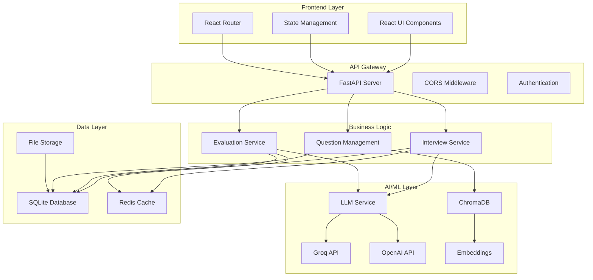
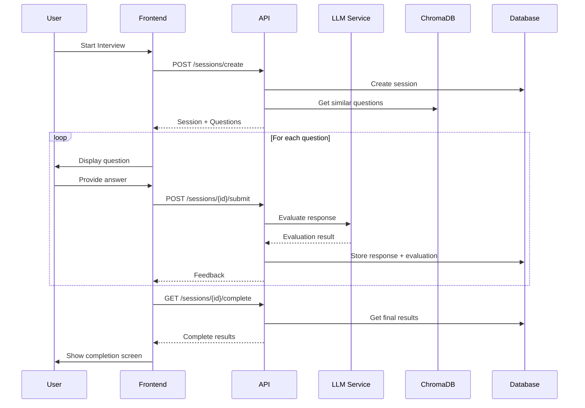
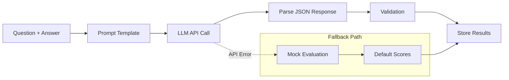

# Architecture Overview

Technical architecture and design decisions for the AI Excel Interview platform.

## 🏗️ System Architecture



## 🎯 Design Principles

### 1. **Modular Architecture**
- **Services**: Loosely coupled, single responsibility
- **Layers**: Clear separation between UI, API, business logic, and data
- **Dependencies**: Minimal coupling, dependency injection ready

### 2. **AI-First Design**
- **LLM Integration**: Multiple providers with fallbacks
- **Vector Search**: ChromaDB for semantic question similarity
- **Prompt Engineering**: Template-based, version controlled
- **Evaluation Pipeline**: Multi-criteria scoring with confidence metrics

### 3. **Developer Experience**
- **Type Safety**: Full TypeScript frontend, Pydantic backend
- **API Documentation**: Auto-generated with FastAPI
- **Hot Reload**: Both frontend and backend development servers
- **Testing Ready**: Structured for unit and integration tests

### 4. **Production Ready**
- **Error Handling**: Graceful degradation and fallbacks
- **Logging**: Structured logging with different levels
- **Configuration**: Environment-based settings
- **Monitoring**: Health checks and metrics ready

## 📁 Directory Structure

```
├── apps/
│   ├── web/                    # React Frontend
│   │   ├── src/
│   │   │   ├── components/     # React components
│   │   │   │   ├── ui/         # shadcn/ui components
│   │   │   │   ├── LandingPage.tsx
│   │   │   │   ├── Instructions.tsx
│   │   │   │   ├── InterviewWindow.tsx
│   │   │   │   └── Completion.tsx
│   │   │   ├── hooks/          # Custom React hooks
│   │   │   ├── lib/            # Utilities and API client
│   │   │   ├── pages/          # Route components
│   │   │   └── App.tsx         # Main application
│   │   ├── public/             # Static assets
│   │   ├── package.json        # Dependencies
│   │   ├── vite.config.ts      # Vite configuration
│   │   └── .env                # Environment variables
│   │
│   └── api/                    # FastAPI Backend
│       ├── app/
│       │   ├── core/           # Core infrastructure
│       │   │   ├── config.py   # Configuration management
│       │   │   ├── database.py # Database setup
│       │   │   └── redis.py    # Redis client
│       │   ├── models/         # Database models
│       │   │   ├── base.py
│       │   │   ├── user.py
│       │   │   └── interview.py
│       │   ├── schemas/        # Pydantic schemas
│       │   │   ├── base.py
│       │   │   ├── user.py
│       │   │   └── interview.py
│       │   ├── services/       # Business logic
│       │   │   ├── llm_service.py
│       │   │   ├── chroma_service.py
│       │   │   └── auth_service.py
│       │   ├── routers/        # API endpoints
│       │   │   ├── interview.py
│       │   │   └── sessions.py
│       │   ├── prompts/        # LLM prompt templates
│       │   │   ├── evaluation_*.txt
│       │   │   └── follow_up_question.txt
│       │   └── main.py         # FastAPI application
│       ├── requirements.txt    # Python dependencies
│       └── .env                # Environment variables
│
├── packages/                   # Shared packages
│   ├── eslint-config/          # ESLint configuration
│   ├── typescript-config/      # TypeScript configuration
│   └── ui/                     # Shared UI components
│
├── docs/                       # Documentation
│   ├── README.md
│   ├── SETUP.md
│   ├── DEBUGGING.md
│   └── ARCHITECTURE.md
│
├── scripts/                    # Utility scripts
├── package.json               # Root dependencies
├── turbo.json                 # Turbo configuration
└── yarn.lock                  # Dependency lock file
```

## 🔧 Component Details

### Frontend Architecture

#### **React Components Hierarchy**
```
App
├── BrowserRouter
│   ├── LandingPage          # Interview introduction
│   ├── Instructions         # Pre-interview setup
│   ├── InterviewWindow      # Main interview interface
│   ├── Completion          # Results and feedback
│   └── NotFound            # 404 page
```

#### **State Management**
- **Local State**: React hooks (useState, useEffect)
- **API State**: TanStack Query for server state
- **Interview State**: Custom hooks for interview flow
- **Global State**: Context API for shared state

#### **Key Components**
- **InterviewWindow**: Main interview interface with question display and answer capture
- **Completion**: Results visualization with scores and feedback
- **UI Components**: shadcn/ui for consistent, accessible design
- **API Client**: Axios-based client with interceptors

### Backend Architecture

#### **FastAPI Application Structure**
```python
# main.py - Application entry point
app = FastAPI(
    title="Autonomous Interview API",
    docs_url="/docs",
    redoc_url="/redoc"
)

# CORS configuration for frontend access
app.add_middleware(CORSMiddleware, ...)

# Route registration
app.include_router(interview.router, prefix="/api/v1/interview")
```

#### **Database Models**
```python
# SQLAlchemy models with async support
class InterviewSession(Base):
    id: Mapped[UUID]
    title: Mapped[str]
    description: Mapped[str]
    created_at: Mapped[datetime]
    
class Question(Base):
    id: Mapped[UUID]
    text: Mapped[str]
    question_type: Mapped[str]
    difficulty: Mapped[str]
    
class InterviewResponse(Base):
    id: Mapped[UUID]
    session_id: Mapped[UUID]
    question_id: Mapped[UUID]
    answer: Mapped[JSON]
    evaluation: Mapped[JSON]
```

#### **Service Layer**
- **LLMService**: Handles AI model interactions and evaluation
- **ChromaService**: Manages vector storage and similarity search  
- **AuthService**: User authentication and authorization
- **CacheService**: Redis-based caching with fallbacks

### AI/ML Architecture

#### **LLM Integration**
```python
class LLMService:
    def __init__(self):
        self.client = Groq(api_key=settings.GROQ_API_KEY)
        self.model = "mixtral-8x7b-32768"
        
    async def evaluate_response(self, question, answer):
        # Template-based prompt generation
        prompt = self.prompts[f"evaluation_{question.type}"].format(
            question=question.text,
            answer=json.dumps(answer)
        )
        
        # LLM inference with structured output
        response = await self.client.chat.completions.create(
            messages=[...],
            model=self.model,
            response_format={"type": "json_object"}
        )
        
        return EvaluationResult(**json.loads(response.content))
```

#### **Vector Storage**
```python
class ChromaService:
    def __init__(self):
        self.client = chromadb.PersistentClient(path="./chroma_data")
        
    def get_or_create_collection(self, name):
        return self.client.get_or_create_collection(
            name=name,
            embedding_function=embedding_functions.DefaultEmbeddingFunction(),
            metadata={"hnsw:space": "cosine"}
        )
```

## 🔄 Data Flow

### Interview Session Flow


### AI Evaluation Pipeline


## 🚀 Deployment Architecture

### Development
- **Frontend**: Vite dev server (port 5000)
- **Backend**: Uvicorn with reload (port 8000)
- **Database**: SQLite with WAL mode
- **AI Services**: Mock responses (no API keys required)

### Production
- **Frontend**: Static build served by CDN
- **Backend**: Uvicorn with multiple workers
- **Database**: PostgreSQL with connection pooling
- **Cache**: Redis for session management
- **AI Services**: Real API keys with rate limiting
- **Monitoring**: Health checks and metrics

## 🔐 Security Considerations

### Current Implementation
- **CORS**: Configured for development origins
- **Environment Variables**: Secrets in .env files
- **Input Validation**: Pydantic schemas
- **SQL Injection**: SQLAlchemy ORM protection

### Production Recommendations
- **Authentication**: JWT tokens with refresh
- **Authorization**: Role-based access control
- **Rate Limiting**: API endpoint protection
- **HTTPS**: SSL/TLS encryption
- **Secrets Management**: External vault integration
- **Audit Logging**: User action tracking

## 📊 Performance Considerations

### Current Optimizations
- **Async/Await**: Non-blocking I/O operations
- **Connection Pooling**: Database connection reuse
- **Lazy Loading**: Services initialized on demand
- **Caching**: Redis for frequently accessed data

### Scaling Strategies
- **Horizontal Scaling**: Multiple API server instances
- **Database Sharding**: Partition by user/session
- **CDN**: Static asset delivery
- **Load Balancing**: Request distribution
- **Caching Layers**: Multi-level caching strategy

This architecture provides a solid foundation for building an enterprise-grade AI interview platform while maintaining developer productivity and code quality.